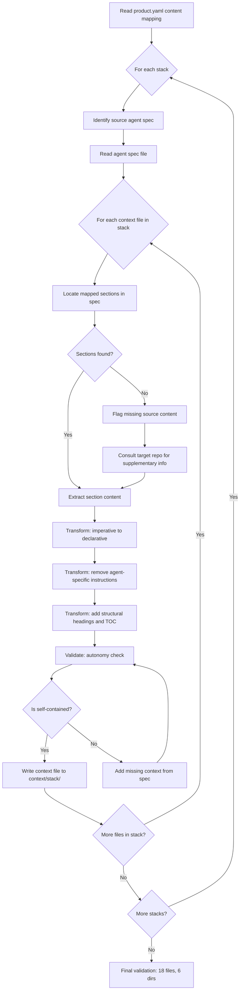

# Centralized Project Context Stacks - Technical Solution Proposal

**Date**: 2026-03-27
**Author**: Architecture Team
**Status**: Draft

---

## 1. Solution Overview

### Problem Statement

The AI agent specifications in `plugins/` are comprehensive documents (1000-1750+ lines each) that contain the full knowledge an agent needs for development, code review, and task execution. When a sub-agent (Claude Code or Gemini CLI) needs to perform a task on a specific project, it must load the entire specification to access architectural context, even if only a fraction of the document is relevant. This creates three problems:

1. **Token waste**: Loading a 1750-line agent spec consumes significant context window for information the agent does not need for the current task.
2. **Context dilution**: Mixing behavioral instructions ("you MUST", "NEVER do") with project knowledge (architecture, patterns, state management) reduces precision.
3. **No selective loading**: Sub-agents cannot load only "the architecture of the Flutter app" without also loading all the BLoC templates, testing patterns, and response format instructions.

### Proposed Solution

Extract and distill the project-specific knowledge from each agent specification into 3 standalone context files per project stack. These files live in `context/{stack-name}/` at the repository root and can be referenced individually by sub-agents. The content is derived from the source specifications (never invented), transformed from agent instructions into descriptive documentation, and designed to be self-contained.

### Scope

**In scope**:
- 6 project stacks: flutter-app, flutter-library, nextjs-app, python-api, python-library, python-celery
- 3 context files per stack: architecture.md, widget_patterns.md (or api_patterns.md for Python), state_management.md
- 18 total Markdown files generated from 5 source agent specifications
- Directory structure: `context/{stack-name}/` at repository root

**Out of scope**:
- Modification of the source agent specifications in `plugins/`
- Integration with CI/CD pipelines for automatic generation
- Gemini CLI configuration changes to reference context files
- Claude Code agent spec updates to reference context files (follow-up work)

---

## 2. Component Architecture

### Component Diagram

```mermaid
graph TB
    subgraph "Source: Agent Specifications (plugins/)"
        MF[mobile-flutter.md<br/>1750 lines]
        RFA[reviewer-flutter-app.md<br/>1300 lines]
        FN[frontend-nextjs.md<br/>1715 lines]
        BP[backend-py.md<br/>644 lines]
        RLP[reviewer-library-py.md<br/>1997 lines]
    end

    subgraph "Process: Extract & Transform"
        EXT[Section Extraction<br/>per product.yaml mapping]
        TRF[Content Transformation<br/>imperative -> declarative]
        VAL[Validation<br/>autonomy & traceability]
    end

    subgraph "Output: Context Files (context/)"
        subgraph "flutter-app/"
            FA_ARCH[architecture.md]
            FA_WP[widget_patterns.md]
            FA_SM[state_management.md]
        end
        subgraph "flutter-library/"
            FL_ARCH[architecture.md]
            FL_WP[widget_patterns.md]
            FL_SM[state_management.md]
        end
        subgraph "nextjs-app/"
            NA_ARCH[architecture.md]
            NA_WP[widget_patterns.md]
            NA_SM[state_management.md]
        end
        subgraph "python-api/"
            PA_ARCH[architecture.md]
            PA_AP[api_patterns.md]
            PA_SM[state_management.md]
        end
        subgraph "python-library/"
            PL_ARCH[architecture.md]
            PL_AP[api_patterns.md]
            PL_SM[state_management.md]
        end
        subgraph "python-celery/"
            PC_ARCH[architecture.md]
            PC_AP[api_patterns.md]
            PC_SM[state_management.md]
        end
    end

    subgraph "Consumers: Sub-agents"
        CLAUDE[Claude Code Agents]
        GEMINI[Gemini CLI Agents]
    end

    MF --> EXT
    RFA --> EXT
    FN --> EXT
    BP --> EXT
    RLP --> EXT

    EXT --> TRF
    TRF --> VAL

    VAL --> FA_ARCH
    VAL --> FA_WP
    VAL --> FA_SM
    VAL --> FL_ARCH
    VAL --> FL_WP
    VAL --> FL_SM
    VAL --> NA_ARCH
    VAL --> NA_WP
    VAL --> NA_SM
    VAL --> PA_ARCH
    VAL --> PA_AP
    VAL --> PA_SM
    VAL --> PL_ARCH
    VAL --> PL_AP
    VAL --> PL_SM
    VAL --> PC_ARCH
    VAL --> PC_AP
    VAL --> PC_SM

    FA_ARCH --> CLAUDE
    FA_WP --> CLAUDE
    FA_SM --> CLAUDE
    PA_ARCH --> GEMINI
    PA_AP --> GEMINI
    PA_SM --> GEMINI
```

### Components Description

| Component | Responsibility | Layer | Dependencies |
|-----------|---------------|-------|--------------|
| Agent Specifications | Source of truth for project knowledge | Source data (plugins/) | None |
| Section Extraction | Identify and extract relevant sections from specs per product.yaml mapping | Process | Agent Specifications, product.yaml content mapping |
| Content Transformation | Convert agent instructions to descriptive documentation | Process | Extracted sections |
| Validation | Verify autonomy, traceability, format consistency | Process | Transformed content |
| Context Files | Standalone project knowledge documentation | Output (context/) | None (self-contained) |
| Sub-agent Consumers | AI agents that reference context files during task execution | Consumer | Context Files (read-only) |

### Interface Definitions

This feature has no programmatic interfaces. The "interface" is the file system:

- **Input contract**: Markdown files at `plugins/{domain}/agents/{agent}.md` following the existing agent spec format (YAML frontmatter + Markdown body)
- **Output contract**: Markdown files at `context/{stack-name}/{file-type}.md` following the templates defined in the technical.yaml
- **Consumer contract**: Sub-agents reference context files by absolute or relative path in their prompts or tool calls

---

## 3. Flow Diagrams

### Content Extraction Flow

---

## 4. Data Model

This feature does not create or modify database entities. All artifacts are static Markdown files versioned in git. No data model section is applicable.

---

## 5. API Design

This feature does not expose or modify API endpoints. All artifacts are static files consumed by reading from the file system. No API design section is applicable.

---

## 6. Technical Decisions

### Decision 1: Static Markdown files vs. dynamic generation

- **Options considered**: Static Markdown files in git; Script-generated files in CI/CD; API-queryable context database
- **Selected**: Static Markdown files in git
- **Justification**: Context content changes infrequently (only when agent specs change). Static files are auditable via git history, require zero infrastructure, and are directly readable by any tool. The added complexity of CI/CD generation or a database is not justified for 18 files that change at most quarterly.

### Decision 2: Flat directory structure (context/{stack}/) vs. grouped by technology

- **Options considered**: `context/{stack}/` (flat); `context/{technology}/{stack}/` (grouped)
- **Selected**: Flat `context/{stack}/`
- **Justification**: Only 6 stacks exist. Grouping by technology adds an unnecessary nesting level that complicates path references for sub-agents. If the number of stacks grows significantly (20+), grouping could be reconsidered.

### Decision 3: Three files per stack vs. single consolidated file

- **Options considered**: 3 files (architecture, patterns, state); 1 consolidated file; N files (one per concern)
- **Selected**: 3 files per stack
- **Justification**: Three files strike the balance between granularity (sub-agents can load only what they need) and simplicity (manageable number of files). A single file would recreate the "load everything" problem. More granular splitting (5-10 files) would fragment knowledge too much and create navigation overhead.

### Decision 4: api_patterns.md for Python stacks instead of widget_patterns.md

- **Options considered**: Same filename (widget_patterns.md) for all stacks; Different filename (api_patterns.md) for Python; No patterns file for Python
- **Selected**: api_patterns.md for Python stacks
- **Justification**: The name must reflect the content accurately. Python backends do not have widgets; they have API endpoints, DTOs, middleware, and validation patterns. Using the same filename would be semantically incorrect and confusing.

### Decision 5: Content extraction from existing specs only (no new authoring)

- **Options considered**: Extract from specs only; Author new content independently; Hybrid (extract + supplement)
- **Selected**: Extract from specs only, with distillation for autonomy
- **Justification**: The agent specifications are the maintained source of truth. Creating independent content would risk divergence and dual maintenance burden. Distillation (restructuring for standalone readability) is acceptable; invention (adding information not in the spec) is not.

---

## 7. Implementation Phases

| Phase | Description | Duration | Dependencies |
|-------|-------------|----------|--------------|
| Phase 1: Foundation | Create directory structure + generate flutter-app and python-api context files (2 stacks, 6 files) | Probable: 3 days | None |
| Phase 2: Frontend Stacks | Generate flutter-library and nextjs-app context files (2 stacks, 6 files) | Probable: 3 days | Phase 1 |
| Phase 3: Backend Stacks | Generate python-library and python-celery context files (2 stacks, 6 files) | Probable: 3 days | Phase 1 |
| Phase 4: Validation | Cross-review all 18 files for autonomy, traceability, and format consistency | Probable: 2 days | Phase 2 + Phase 3 |

**Total (sequential)**: Probable 11 days | **Total (phases 2+3 parallel)**: Probable 8 days

**Note**: Phases 2 and 3 can execute in parallel since they have no dependencies between each other, only on Phase 1.

---

## 8. Risks & Mitigations

| Risk | Probability | Impact | Mitigation |
|------|-------------|--------|------------|
| python-celery stack requires significant adaptation from backend-py.md (no Celery-specific content in source spec) | Medium | Medium | Consult with backend team for real Celery patterns; use voltop-tasks-server repo as supplementary source |
| Context files become stale when agent specs are updated | Medium | High | Add periodic review process (quarterly); optionally add CI check that flags spec changes |
| Content transformation loses technical precision | Low | High | Preserve exact library names, versions, and patterns from source; validate with domain experts |
| Sub-agents reference wrong context files for a project | Low | Low | Document available context paths in plugin READMEs; use consistent naming conventions |

---

**End of Technical Proposal**