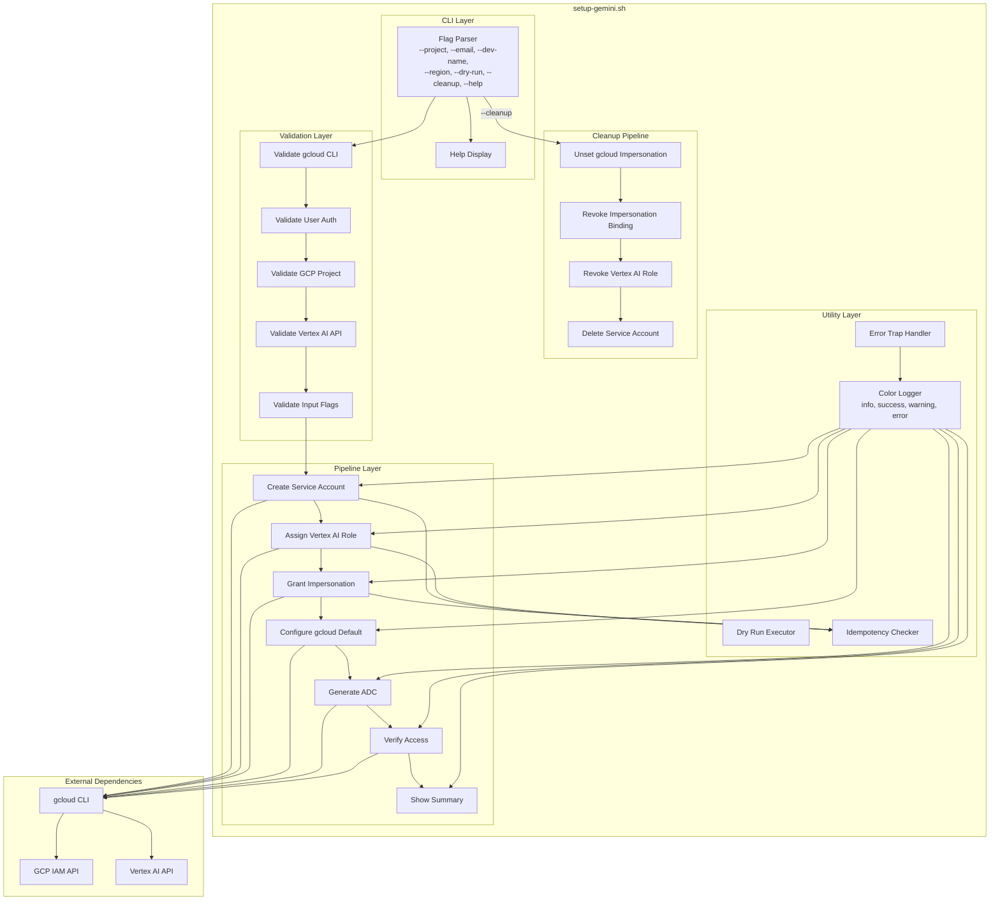
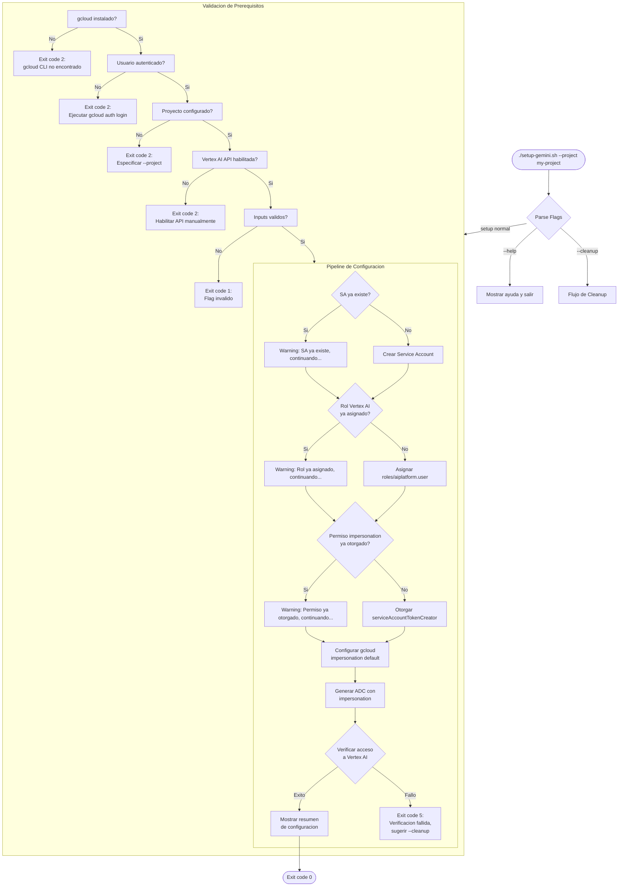
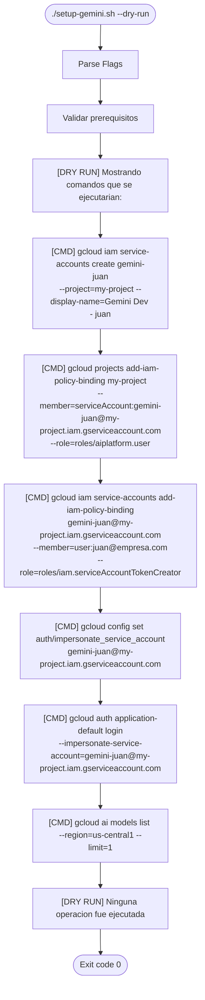
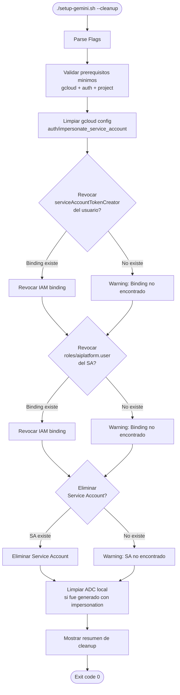
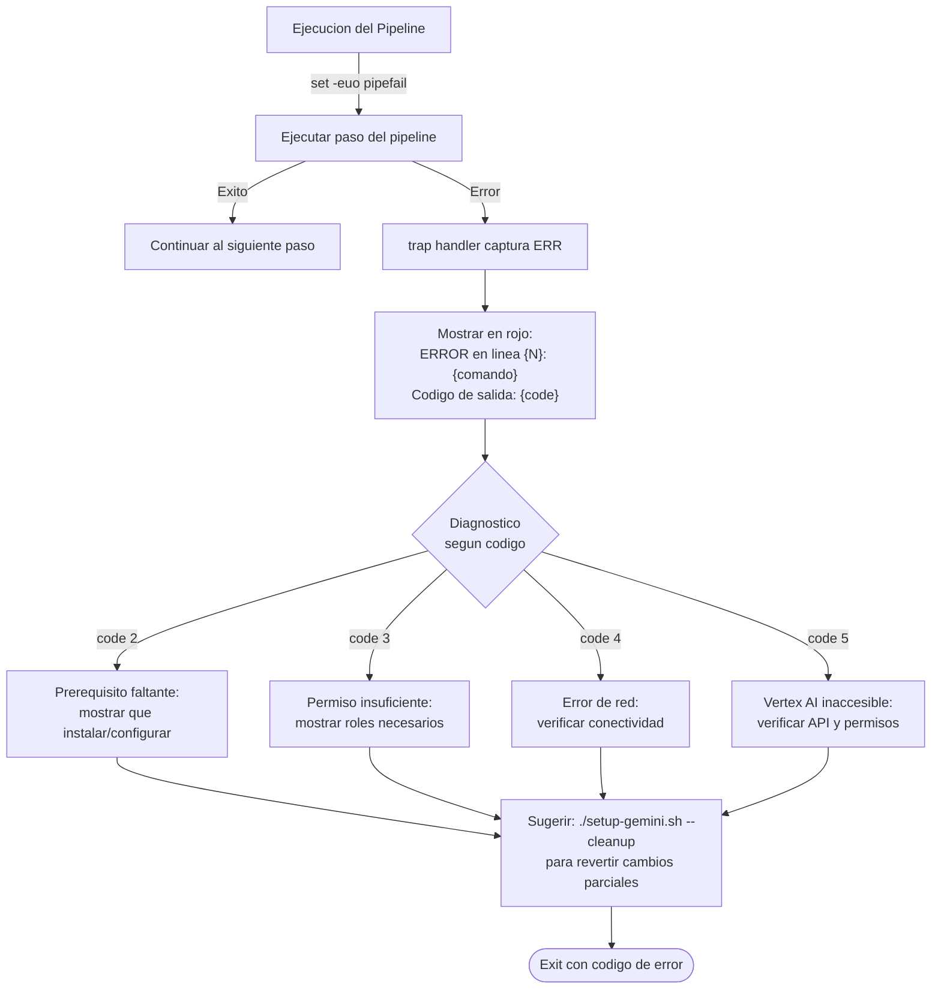

# gemini_initial_config_shell - Technical Solution Proposal

**Date**: 2026-03-28
**Author**: Architecture Team
**Status**: Draft

---

## 1. Solution Overview

### Problem Statement

Los desarrolladores del equipo necesitan autenticarse diariamente con Google Cloud para usar Gemini CLI con Vertex AI. El proceso manual implica ejecutar multiples comandos gcloud en secuencia correcta, recordar roles de IAM especificos y configurar Application Default Credentials con impersonation. Este proceso es propenso a errores, consume tiempo y no es reproducible de forma consistente entre miembros del equipo.

### Proposed Solution

Un script bash unico (`setup-gemini.sh`) que automatiza los 7 pasos del flujo de configuracion de Service Account Impersonation en GCP. El script es idempotente (seguro para re-ejecutar), soporta modo dry-run para previsualizar, modo cleanup para revertir, y utiliza flags nombrados para configuracion flexible.

### Scope

- **In scope**:
  - Creacion automatizada de Service Account dedicado por desarrollador
  - Asignacion de rol minimo (Vertex AI User)
  - Configuracion de Service Account Impersonation
  - Generacion de Application Default Credentials (ADC)
  - Verificacion de acceso a Vertex AI
  - Modo dry-run para previsualizar
  - Modo cleanup para revertir toda la configuracion
  - Validaciones de prerequisitos y manejo de errores
  - Mensajes con colores para feedback visual

- **Out of scope**:
  - Instalacion de gcloud CLI (prerequisito del usuario)
  - Creacion de proyectos GCP
  - Habilitacion automatica de la API de Vertex AI (solo verificacion)
  - Configuracion de Gemini CLI (settings.json, modelos por defecto)
  - CI/CD integration (el script es para uso local de desarrolladores)

---

## 2. Component Architecture

### Component Diagram



### Components Description

| Component | Responsibility | Layer |
|-----------|---------------|-------|
| Flag Parser | Parsear flags CLI (--project, --email, etc.) y asignar valores por defecto | CLI |
| Help Display | Mostrar documentacion de uso con descripcion de todos los flags | CLI |
| Validate gcloud CLI | Verificar que gcloud esta instalado y accesible en PATH | Validation |
| Validate User Auth | Verificar que el usuario tiene una sesion activa en gcloud | Validation |
| Validate GCP Project | Verificar que el proyecto GCP existe y esta accesible | Validation |
| Validate Vertex AI API | Verificar que aiplatform.googleapis.com esta habilitada | Validation |
| Validate Input Flags | Validar formato de email, longitud de dev-name, region valida | Validation |
| Create Service Account | Crear SA gemini-{dev_name} con verificacion de existencia previa | Pipeline |
| Assign Vertex AI Role | Asignar roles/aiplatform.user al SA con verificacion de binding | Pipeline |
| Grant Impersonation | Asignar roles/iam.serviceAccountTokenCreator al usuario | Pipeline |
| Configure gcloud Default | Establecer impersonation como default en gcloud config | Pipeline |
| Generate ADC | Generar Application Default Credentials con impersonation | Pipeline |
| Verify Access | Ejecutar gcloud ai models list para confirmar acceso | Pipeline |
| Show Summary | Mostrar resumen de configuracion e instrucciones de uso | Pipeline |
| Color Logger | Funciones de logging con colores ANSI (info, success, warning, error) | Utility |
| Error Trap Handler | Capturar errores con trap y mostrar diagnostico | Utility |
| Dry Run Executor | Mostrar comandos sin ejecutarlos cuando --dry-run esta activo | Utility |
| Idempotency Checker | Verificar si un recurso ya existe antes de intentar crearlo | Utility |

---

## 3. Flow Diagrams

### Main Flow (Setup)



### Dry Run Flow



### Cleanup Flow



### Error Handling and Trap Flow



---

## 4. Security Considerations

### Security Model

| Aspecto | Estrategia | Detalle |
|---------|-----------|---------|
| **Permisos minimos** | roles/aiplatform.user | Unico rol asignado al SA. No incluye permisos de escritura, admin ni acceso a otros servicios GCP |
| **Sin secrets en disco** | Service Account Impersonation | No se generan ni almacenan key files JSON. Los tokens son efimeros y se renuevan automaticamente via ADC |
| **Sin secrets en el script** | Runtime resolution | Todos los valores sensibles (project ID, email, SA email) se obtienen de gcloud CLI en runtime, no estan hardcodeados |
| **Auditoria individual** | SA por desarrollador | Cada desarrollador tiene su propio SA (gemini-{dev_name}), permitiendo trazabilidad en Cloud Audit Logs |
| **Revocacion granular** | --cleanup por usuario | Se puede revocar el acceso de un desarrollador especifico sin afectar a otros |
| **Dry run seguro** | No expone tokens | El modo --dry-run muestra comandos gcloud pero nunca tokens, credenciales ni IAM policies completas |

### Threat Model

| Amenaza | Probabilidad | Mitigacion |
|---------|-------------|-----------|
| Script modificado maliciosamente | Baja | El script esta versionado en git. Verificar integridad antes de ejecutar. No ejecutar desde fuentes no confiables |
| Escalacion de privilegios via SA | Baja | El SA solo tiene roles/aiplatform.user. No puede acceder a otros servicios GCP ni escalar permisos |
| SA compartido entre desarrolladores | Media | El script genera un SA unico por dev_name. Documentar que cada desarrollador debe usar su propio nombre |
| Credenciales ADC expuestas | Baja | ADC con impersonation genera tokens efimeros. Incluso si el archivo ADC es comprometido, los tokens expiran rapidamente |

---

## 5. Technical Decisions

### Decision 1: Script bash monolitico vs. multiples scripts

- **Options considered**: Script unico, Makefile con targets, Multiples scripts con orquestador
- **Selected**: Script unico
- **Justification**: El flujo es estrictamente secuencial (7 pasos dependientes). Un script unico permite error handling centralizado con trap, rollback coherente con --cleanup, y distribucion simple (un solo archivo).

### Decision 2: Service Account Impersonation vs. Key JSON

- **Options considered**: Impersonation, Key JSON file, Workload Identity Federation
- **Selected**: Impersonation
- **Justification**: Impersonation elimina el riesgo de secrets en disco, no requiere rotacion de keys, y es la practica recomendada por Google Cloud para desarrollo local. Key JSON files son un riesgo de seguridad si se commitean accidentalmente a git.

### Decision 3: Flags CLI con while-case vs. getopts

- **Options considered**: getopts (solo flags cortos), while-case con pattern matching, getopt (GNU)
- **Selected**: while-case con pattern matching
- **Justification**: while-case soporta flags largos (--project) y cortos (-p) de forma nativa sin depender de getopt de GNU (que no esta disponible por defecto en macOS). getopts solo soporta flags cortos. La implementacion con while-case es mas portable entre macOS y Linux.

### Decision 4: No rollback automatico en fallo

- **Options considered**: Rollback automatico en fallo, No rollback (solo --cleanup manual)
- **Selected**: No rollback automatico
- **Justification**: Un rollback automatico a mitad del pipeline podria fallar tambien, dejando el estado mas inconsistente. Es mas seguro informar al usuario del paso que fallo y sugerir --cleanup, que ejecuta la reversion completa con verificaciones de idempotencia.

---

## 6. Implementation Phases

| Phase | Description | Duration (probable) | Dependencies |
|-------|-------------|---------------------|--------------|
| Phase 1: Foundation | Estructura base, parseo de flags, validaciones, utilidades de logging y error handling | 4 horas | Ninguna |
| Phase 2: Core Pipeline | Los 7 pasos del flujo principal con verificacion de idempotencia | 5 horas | Phase 1 |
| Phase 3: Dry Run and Cleanup | Modos --dry-run y --cleanup con reversion en orden inverso | 3 horas | Phase 2 |
| Phase 4: Testing and Validation | Pruebas manuales en proyecto GCP real, todos los escenarios | 2 horas | Phase 3 |

**Total estimado**: 14 horas (2 dias de trabajo)

---

## 7. Risks and Mitigations

| Risk | Probability | Impact | Mitigation |
|------|-------------|--------|------------|
| Incompatibilidad bash macOS 3.2 vs Linux 5+ | Medium | Medium | Usar solo features POSIX-compatible o documentar requisito de bash 4+ con instrucciones de instalacion via brew |
| Usuario sin permisos de IAM Admin | Medium | High | Verificar permisos al inicio del script. Mostrar mensaje claro con los roles necesarios y sugerir contactar al administrador del proyecto |
| Vertex AI API no habilitada | Low | Medium | Verificar con gcloud services list. Mostrar instrucciones para habilitar manualmente con gcloud services enable |
| Nombre de SA excede 30 caracteres | Low | Low | Validar longitud antes de crear. Truncar dev_name si es necesario y avisar al usuario |
| El paso de ADC abre el navegador inesperadamente | Low | Low | Documentar en el resumen previo que el paso de ADC abrira una ventana del navegador para autorizar el flujo OAuth |

---

## 8. Usage Examples

### Setup completo

```
./setup-gemini.sh --project my-gcp-project --email juan@empresa.com --dev-name juan
```

### Setup con valores por defecto

```
./setup-gemini.sh
# Usa: proyecto activo en gcloud, email del usuario autenticado, dev-name del username
```

### Preview sin ejecutar

```
./setup-gemini.sh --dry-run --project my-gcp-project
```

### Revertir configuracion

```
./setup-gemini.sh --cleanup --project my-gcp-project --dev-name juan
```

---

**End of Technical Proposal**
