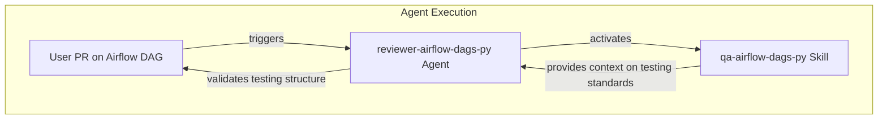

# Propuesta Técnica: Creación de Skill de QA para Airflow DAGs

**Fecha**: 2024-05-24
**Estado**: Draft

---

## 1. Resumen de la Solución

### Problema
El agente `reviewer-airflow-dags-py` carece de un conocimiento estructurado y estandarizado sobre la estrategia de testing específica para los DAGs de Airflow. Esto limita su capacidad para realizar revisiones de código automatizadas que garanticen la calidad y cobertura de las pruebas.

### Solucion Propuesta
Se propone la creación de una nueva "skill" especializada llamada `qa-airflow-dags-py`. Esta skill encapsulará todas las reglas, patrones y estructuras de directorios para las pruebas unitarias y de integración de los DAGs. El agente `reviewer-airflow-dags-py` será actualizado para consumir esta skill, permitiéndole realizar validaciones de testing precisas y consistentes.

### Alcance
- **Incluido**:
  - Creación de la skill `qa-airflow-dags-py` en formatos para Claude y Gemini.
  - Definición detallada de la estructura de tests unitarios y de integración.
  - Actualización del agente `reviewer-airflow-dags-py` para que utilice la nueva skill.
- **Excluido**:
  - Implementación de tests reales en cualquier DAG.
  - Modificación de otros agentes o skills no relacionados.

---

## 2. Arquitectura de Componentes

### Diagrama de Componentes

### Descripcion de Componentes

| Componente | Responsabilidad | Capa | Dependencias |
|---|---|---|---|
| `reviewer-airflow-dags-py` | Agente que revisa PRs de Airflow DAGs. | Agent | `qa-airflow-dags-py` (nueva) |
| `qa-airflow-dags-py` | Skill que define la estrategia de testing para Airflow. | Agent | Ninguna |

---

## 3. Archivos Involucrados

### Archivos a Crear

| Archivo | Propósito | Capa |
|---|---|---|
| `plugins/python-development/skills/qa-airflow-dags-py.md` | Skill para el ecosistema de Claude, define la estrategia de testing. | Agent |
| `gemini/spec-generator/.gemini/skills/qa-airflow-dags-py/SKILL.md` | Skill para el ecosistema de Gemini, con el mismo propósito. | Agent |

### Archivos a Modificar

| Archivo | Cambio Requerido |
|---|---|
| `plugins/python-development/agents/reviewer-airflow-dags-py.md` | Añadir la nueva skill al frontmatter y actualizar el prompt para que la utilice en la validación de tests. |

---

## 4. Fases de Implementacion

| Fase | Descripcion | Dependencias |
|---|---|---|
| 1 - Foundation | Crear los archivos de la skill (`.md` y `SKILL.md`) con la definición de la estrategia de testing. | Ninguna |
| 2 - Integration | Actualizar el agente `reviewer-airflow-dags-py` para que cargue y utilice la nueva skill. | Fase 1 |
